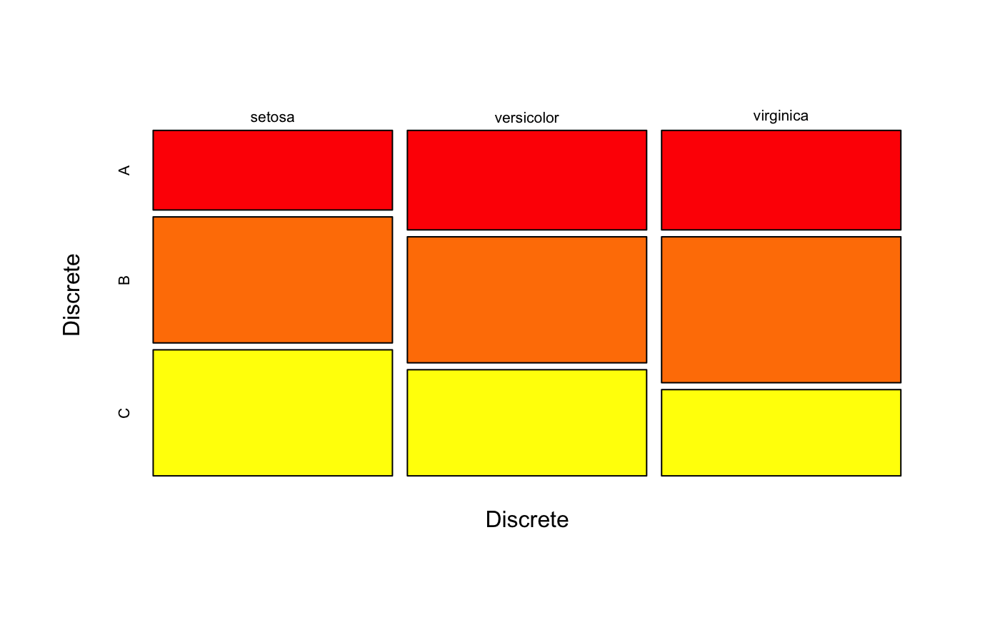
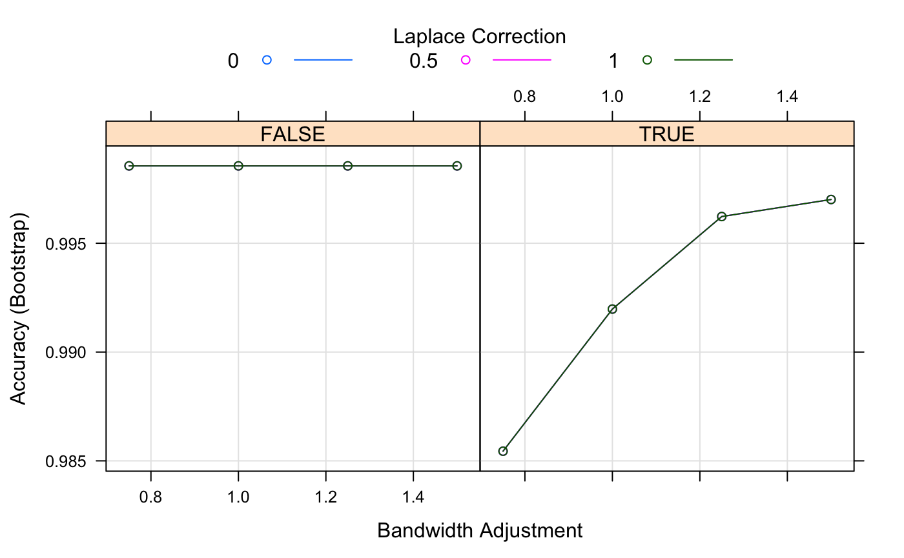

<!-- README.md is generated from README.Rmd. Please edit that file -->

# naivebayes

<!-- # naivebayes  -->

[](https://travis-ci.org/majkamichal/naivebayes)
[](https://cran.r-project.org/package=naivebayes)
[](http://cran.rstudio.com/web/packages/naivebayes/index.html)
[](https://saythanks.io/to/majkamichal)

## 1\. Overview

The `naivebayes` package provides an efficient implementation of the
popular Naïve Bayes classifier. It was developed and is now maintained
based on three principles: it should be efficient, user friendly and
written in `Base R`. The last implies no dependencies, however, it
neither denies nor interferes with the first as many functions from the
`Base R` distribution use highly efficient routines programmed in lower
level languages, such as `C` or `FORTRAN`. In fact, the `naivebayes`
package utilizes only such functions for resource-intensive
calculations. Currently, `naivebayes` supports following class
conditional distributions: categorical distribution for discrete
features, Poisson distribution for non-negative integer (counts)
features and Gaussian distribution or kernel density estimation for
continuous features.

## 2\. Installation

Just like many other `R` packages, `naivebayes` can be installed from
the `CRAN` repository by simply typing into the console the following
line:

``` r
install.packages("naivebayes")

# Or the the development version from GitHub:
devtools::install_github("majkamichal/naivebayes")
```

## 3\. Usage

The `naivebayes` package provides a user friendly implementation of the
Naïve Bayes algorithm via formula interace and classical combination of
the matrix/data.frame containing the features and a vector with the
class labels. The main function `naive_bayes` can be also used within
the excellent `Caret` package via `caret::train` and `naive_bayes`
method. Furthermore the `naive_bayes` function is also available in
`nproc` and `superml` packages. In following the basic usage of the
`naivebayes` package is demonstrated:

``` r
library(naivebayes)

data(iris)
new <- iris[-c(1,2,3)]
# Add one categorical and count variable
set.seed(1)
new$Discrete <- sample(LETTERS[1:3], nrow(new), TRUE) 
new$Counts <- c(rpois(50, 1), rpois(50, 2), rpois(50, 10)) 

# Formula interface
nb <- naive_bayes(Species ~ ., usepoisson = TRUE, data = new)
nb
#> 
#> ================================ Naive Bayes ================================= 
#>  
#>  Call: 
#> naive_bayes.formula(formula = Species ~ ., data = new, usepoisson = TRUE)
#> 
#> ------------------------------------------------------------------------------ 
#>  
#>  A priori probabilities: 
#> 
#>     setosa versicolor  virginica 
#>  0.3333333  0.3333333  0.3333333 
#> 
#> ------------------------------------------------------------------------------ 
#>  
#>  Tables: 
#> 
#> ------------------------------------------------------------------------------ 
#>  ::: Petal.Width (Gaussian) 
#> ------------------------------------------------------------------------------ 
#>            
#> Petal.Width    setosa versicolor virginica
#>        mean 0.2460000  1.3260000 2.0260000
#>        sd   0.1053856  0.1977527 0.2746501
#> 
#> ------------------------------------------------------------------------------ 
#>  ::: Discrete (Categorical) 
#> ------------------------------------------------------------------------------ 
#>         
#> Discrete setosa versicolor virginica
#>        A   0.24       0.30      0.30
#>        B   0.38       0.38      0.44
#>        C   0.38       0.32      0.26
#> 
#> ------------------------------------------------------------------------------ 
#>  ::: Counts (Poisson) 
#> ------------------------------------------------------------------------------ 
#> 
#>        setosa versicolor virginica
#> lambda   1.02       1.94     10.00
#> 
#> ------------------------------------------------------------------------------

# Or equivalently matrix/data.frame and class vector
nb2 <- naive_bayes(x = new[-2], y = new[[2]], usepoisson = TRUE)

# Visualize class conditional probability distributions
plot(nb, which = c("Petal.Width", "Discrete"),
     arg.cat = list(color = heat.colors(3)))
```

<!-- --><!-- -->

``` r

# Browse tables
tables(nb, which = "Discrete") # <=> nb$tables["Discrete"]
#> 
#> ------------------------------------------------------------------------------ 
#>  ::: Discrete (Categorical) 
#> ------------------------------------------------------------------------------ 
#>         
#> Discrete setosa versicolor virginica
#>        A   0.24       0.30      0.30
#>        B   0.38       0.38      0.44
#>        C   0.38       0.32      0.26
#> 
#> ------------------------------------------------------------------------------

# Get name of conditional distributions for each feature
get_cond_dist(nb) # <=> attr(nb$tables, "cond_dist") 
#>   Petal.Width      Discrete        Counts 
#>    "Gaussian" "Categorical"     "Poisson"

# data.frame("Dist" = get_cond_dist(nb))

# Classification
head(predict(nb))
#> [1] setosa setosa setosa setosa setosa setosa
#> Levels: setosa versicolor virginica

# Posterior probabilities
head(predict(nb, type = "prob"))
#>         setosa   versicolor    virginica
#> [1,] 0.9999999 5.062555e-08 1.641993e-13
#> [2,] 1.0000000 4.050044e-08 1.521004e-13
#> [3,] 1.0000000 2.129405e-08 1.551424e-14
#> [4,] 1.0000000 3.410564e-08 8.987751e-14
#> [5,] 0.9999999 5.062555e-08 1.641993e-13
#> [6,] 0.9999910 9.011575e-06 2.355152e-12
```

### 3.1 Usage with Caret package

``` r
library(caret, quietly = TRUE)
library(naivebayes)

# Train the Naive Bayes model with the Caret package
naive_bayes_via_caret <- train(Species ~ ., 
                               data = new, 
                               method = "naive_bayes", 
                               usepoisson = TRUE)

naive_bayes_via_caret
#> Naive Bayes 
#> 
#> 150 samples
#>   3 predictor
#>   3 classes: 'setosa', 'versicolor', 'virginica' 
#> 
#> No pre-processing
#> Resampling: Bootstrapped (25 reps) 
#> Summary of sample sizes: 150, 150, 150, 150, 150, 150, ... 
#> Resampling results across tuning parameters:
#> 
#>   usekernel  Accuracy   Kappa    
#>   FALSE      0.9934678  0.9901375
#>    TRUE      0.9879683  0.9817838
#> 
#> Tuning parameter 'laplace' was held constant at a value of 0
#> 
#> Tuning parameter 'adjust' was held constant at a value of 1
#> Accuracy was used to select the optimal model using the largest value.
#> The final values used for the model were laplace = 0, usekernel =
#>  FALSE and adjust = 1.

# Classification
head(predict(naive_bayes_via_caret, newdata = new))
#> [1] setosa setosa setosa setosa setosa setosa
#> Levels: setosa versicolor virginica

# Posterior probabilities
head(predict(naive_bayes_via_caret, newdata = new, type = "prob"))
#>      setosa   versicolor    virginica
#> 1 1.0000000 2.998060e-08 8.549798e-13
#> 2 1.0000000 2.998060e-08 1.109420e-12
#> 3 1.0000000 2.745780e-08 9.508122e-13
#> 4 1.0000000 2.195599e-08 4.147914e-13
#> 5 1.0000000 2.998060e-08 8.549798e-13
#> 6 0.9999899 1.010541e-05 9.132627e-11

## Recover the naive_bayes object
nb_object <- naive_bayes_via_caret$finalModel
class(nb_object)
#> [1] "naive_bayes"
```

Define tuning grid, do resampling and find the “optimal” model:

``` r

# Define tuning grid 
nb_grid <-   expand.grid(usekernel = c(TRUE, FALSE),
                         laplace = c(0, 0.5, 1), 
                         adjust = c(0.75, 1, 1.25, 1.5))
# Fit the Naive Bayes model 
set.seed(2550)
naive_bayes_via_caret2 <- train(Species ~ ., data = new, 
                               method = "naive_bayes",
                               usepoisson = TRUE,
                               tuneGrid = nb_grid)
# Selected tuning parameters
naive_bayes_via_caret2$finalModel$tuneValue
#>    laplace usekernel adjust
#> 15       0      TRUE   1.25

## View the final naive_bayes model
# naive_bayes_via_caret2$finalModel

# Visualize the tuning process
plot(naive_bayes_via_caret2)
```

<!-- -->

``` r

# Perform classification 
head(predict(naive_bayes_via_caret2, newdata = new))
#> [1] setosa setosa setosa setosa setosa setosa
#> Levels: setosa versicolor virginica
```

### 3.2 Usage with nproc package

Please find more information about the `nproc` package under:
<https://cran.r-project.org/web/packages/nproc/>

``` r
library(nproc)
library(naivebayes)

# Simulate data
set.seed(2550)
n <- 1000
x <- matrix(rnorm(n * 2), n, 2)
c <- 1 + 3 * x[ ,1]
y <- rbinom(n, 1, 1 / (1 + exp(-c)))
xtest <- matrix(rnorm(n * 2), n, 2)
ctest <- 1 + 3 * xtest[,1]
ytest <- rbinom(n, 1, 1 / (1 + exp(-ctest)))


# Use Naive Bayes classifier and the default type I error control with alpha=0.05
naive_bayes_via_nproc <- npc(x, y, method = "nb")

## Recover the "naive_bayes" object
# naive_bayes_via_nproc$fits[[1]]$fit

# Classification
nb_pred <- predict(naive_bayes_via_nproc, xtest)

# head(nb_pred$pred.label)

# Obtain various measures
accuracy <- mean(nb_pred$pred.label == ytest)
ind0 <- which(ytest == 0)
ind1 <- which(ytest == 1)
typeI <- mean(nb_pred$pred.label[ind0] != ytest[ind0]) #type I error on test set
typeII <- mean(nb_pred$pred.label[ind1] != ytest[ind1]) #type II error on test set

cat(" Overall Accuracy: ",  accuracy,"\n", 
    "Type I error:     ", typeI, "\n",
    "Type II error:    ", typeII, "\n")
#>  Overall Accuracy:  0.68 
#>  Type I error:      0.02072539 
#>  Type II error:     0.5081433
```

### 3.3 Usage with superml package

Please find more information about the `superml` package under:
<https://cran.r-project.org/web/packages/superml/>

``` r
library(superml)
data(iris)
naive_bayes_via_superml <- NBTrainer$new()
naive_bayes_via_superml$fit(iris, 'Species')

## Recover the naive_bayes object
# naive_bayes_via_superml$model

# Classification
head(naive_bayes_via_superml$predict(iris))
#> [1] setosa setosa setosa setosa setosa setosa
#> Levels: setosa versicolor virginica

# Posterior probabilites
head(naive_bayes_via_superml$predict(iris, type = "prob"))
#>      setosa   versicolor    virginica
#> [1,]      1 2.981309e-18 2.152373e-25
#> [2,]      1 3.169312e-17 6.938030e-25
#> [3,]      1 2.367113e-18 7.240956e-26
#> [4,]      1 3.069606e-17 8.690636e-25
#> [5,]      1 1.017337e-18 8.885794e-26
#> [6,]      1 2.717732e-14 4.344285e-21
```
