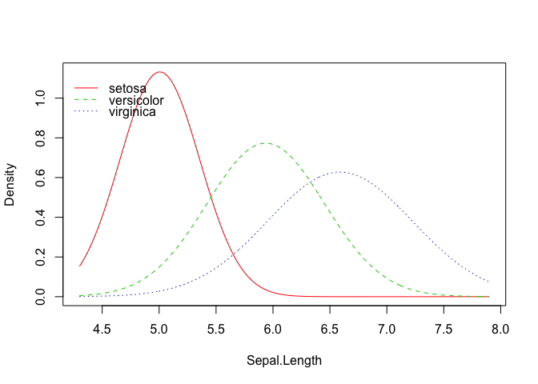
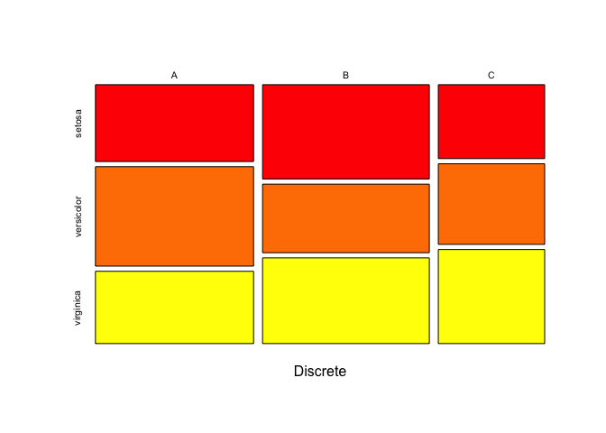
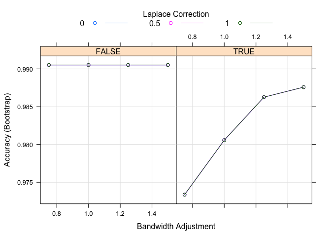

<!-- README.md is generated from README.Rmd. Please edit that file -->

# naivebayes

[](https://cran.r-project.org/package=naivebayes)
[](http://cran.rstudio.com/web/packages/naivebayes/index.html)

## Overview

The `naivebayes` package provides an efficient implementation of the
popular Naïve Bayes classifier. It was developed and is now maintained
based on three principles: it should be efficient, user friendly and
written in `Base R`. The last implies no dependencies, however, it
neither denies nor interferes with the first as many functions from the
`Base R` distribution use highly efficient routines programmed in lower
level languages, such as `C` or `FORTRAN`. In fact, the `naivebayes`
package utilizes only such functions for resource-intensive
calculations. Currently, `naivebayes` supports following class
conditional distributions: categorical distribution for discrete
features, Poisson distribution for non-negative integer (counts)
features and Gaussian distribution or kernel density estimation for
continuous features.

## Installation

``` r
install.packages("naivebayes")

# Or the the development version from GitHub:
devtools::install_github("majkamichal/naivebayes")
```

## Usage

The `naivebayes` package provides a user friendly implementation of the
Naïve Bayes algorithm via formula interace and classical combination of
the matrix/data.frame containing the features and a vector with the
class labels. The main function `naive_bayes` can be also used within
the excellent `Caret` package via `caret::train` and `naive_bayes`
method. In following the basic usage of the `naivebayes` package is
demonstrated:

``` r
library(naivebayes)

data(iris)
new <- iris[-c(1,2,3)]
# Add one categorical and count variable
new$Discrete <- sample(LETTERS[1:3], nrow(new), TRUE) 
new$Counts <- c(rpois(50, 1), rpois(50, 2), rpois(50, 10)) 

# Formula interface
nb <- naive_bayes(Species ~ ., data = new)
nb
#> 
#> ================================ Naive Bayes ================================= 
#>  
#> Call: 
#> naive_bayes.formula(formula = Species ~ ., data = new)
#> 
#> ------------------------------------------------------------------------------ 
#> 
#> A priori probabilities: 
#> 
#>     setosa versicolor  virginica 
#>  0.3333333  0.3333333  0.3333333 
#> 
#> ------------------------------------------------------------------------------
#> 
#> Tables:
#> 
#> ------------------------------------------------------------------------------
#>  ::: Petal.Width (Gaussian)
#> ------------------------------------------------------------------------------
#>            
#> Petal.Width    setosa versicolor virginica
#>        mean 0.2460000  1.3260000 2.0260000
#>        sd   0.1053856  0.1977527 0.2746501
#> 
#> ------------------------------------------------------------------------------
#>  ::: Discrete (Categorical)
#> ------------------------------------------------------------------------------
#>         
#> Discrete setosa versicolor virginica
#>        A   0.34       0.44      0.32
#>        B   0.44       0.32      0.40
#>        C   0.22       0.24      0.28
#> 
#> ------------------------------------------------------------------------------
#>  ::: Counts (Poisson)
#> ------------------------------------------------------------------------------
#> 
#>        setosa versicolor virginica
#> lambda   0.84       1.94     10.18
#> 
#> ------------------------------------------------------------------------------

# Or equivalently matrix/data.frame and class vector
nb2 <- naive_bayes(x = new[-2], y = new[[2]])

# Visualize class conditional probability distributions
plot(nb, which = c("Petal.Width", "Discrete"),
     arg.cat = list(color = heat.colors(3)))
```

<!-- --><!-- -->

``` r

# Browse tables
tables(nb, which = "Discrete")
#> 
#> 
#> ------------------------------------------------------------------------------
#>  ::: Discrete (Categorical)
#> ------------------------------------------------------------------------------
#>         
#> Discrete setosa versicolor virginica
#>        A   0.34       0.44      0.32
#>        B   0.44       0.32      0.40
#>        C   0.22       0.24      0.28
#> ------------------------------------------------------------------------------

# Classification
head(predict(nb))
#> [1] setosa setosa setosa setosa setosa setosa
#> Levels: setosa versicolor virginica

# Posterior probabilities
head(predict(nb, type = "prob"))
#>         setosa   versicolor    virginica
#> [1,] 1.0000000 2.987480e-08 1.029891e-13
#> [2,] 0.9999999 1.227733e-07 1.292181e-12
#> [3,] 1.0000000 2.301754e-08 8.798051e-15
#> [4,] 0.9999998 1.593492e-07 1.512614e-11
#> [5,] 1.0000000 1.293548e-08 8.498118e-15
#> [6,] 0.9999902 9.751009e-06 3.056456e-12
```

### Usage with Caret package

``` r
library(caret, quietly = TRUE)
library(naivebayes)

# Train the Naive Bayes model with the Caret package
naive_bayes_via_caret <- train(Species ~ ., data = new, 
                               method = "naive_bayes")

naive_bayes_via_caret
#> Naive Bayes 
#> 
#> 150 samples
#>   3 predictor
#>   3 classes: 'setosa', 'versicolor', 'virginica' 
#> 
#> No pre-processing
#> Resampling: Bootstrapped (25 reps) 
#> Summary of sample sizes: 150, 150, 150, 150, 150, 150, ... 
#> Resampling results across tuning parameters:
#> 
#>   usekernel  Accuracy   Kappa    
#>   FALSE      0.9914234  0.9869458
#>    TRUE      0.9876420  0.9812460
#> 
#> Tuning parameter 'laplace' was held constant at a value of 0
#> 
#> Tuning parameter 'adjust' was held constant at a value of 1
#> Accuracy was used to select the optimal model using the largest value.
#> The final values used for the model were laplace = 0, usekernel =
#>  FALSE and adjust = 1.

# Classification
head(predict(naive_bayes_via_caret, newdata = new))
#> [1] setosa setosa setosa setosa setosa setosa
#> Levels: setosa versicolor virginica

# Posterior probabilities
head(predict(naive_bayes_via_caret, newdata = new, type = "prob"))
#>      setosa   versicolor    virginica
#> 1 0.9999995 4.904101e-07 1.200405e-11
#> 2 1.0000000 3.927220e-08 1.386642e-12
#> 3 1.0000000 3.265983e-08 1.381712e-13
#> 4 1.0000000 1.859597e-08 1.147912e-13
#> 5 1.0000000 3.927220e-08 1.386642e-12
#> 6 0.9999856 1.442632e-05 2.208568e-11

# Recover the naive_bayes object
nb_object <- naive_bayes_via_caret$finalModel
class(nb_object)
#> [1] "naive_bayes"
```

Define tuning grid, do resampling and find the “optimal” model:

``` r

# Define tuning grid 
nb_grid <-   expand.grid(usekernel = c(TRUE, FALSE),
                         laplace = c(0, 0.5, 1), 
                         adjust = c(0.75, 1, 1.25, 1.5))
# Fit the Naive Bayes model 
naive_bayes_via_caret2 <- train(Species ~ ., data = new, 
                               method = "naive_bayes",
                               tuneGrid = nb_grid)
# Selected tuning parameters
naive_bayes_via_caret2$finalModel$tuneValue
#>   laplace usekernel adjust
#> 1       0     FALSE   0.75

## View the final naive_bayes model
# naive_bayes_via_caret2$finalModel

# Visualize the tuning process
plot(naive_bayes_via_caret2)
```

<!-- -->

``` r

# Perform classification 
head(predict(naive_bayes_via_caret2, newdata = new))
#> [1] setosa setosa setosa setosa setosa setosa
#> Levels: setosa versicolor virginica
```
