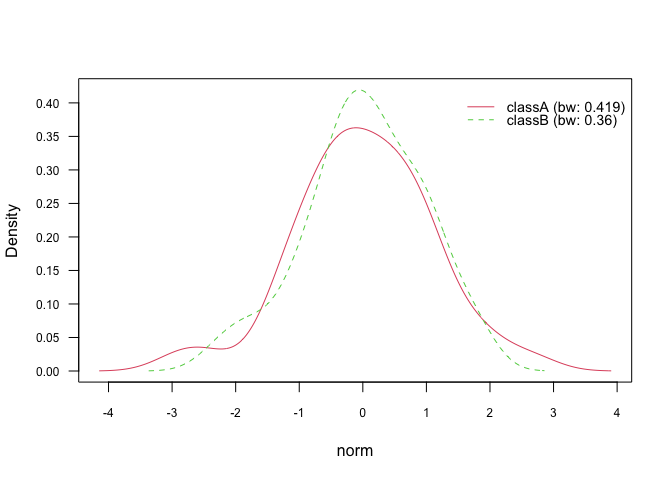
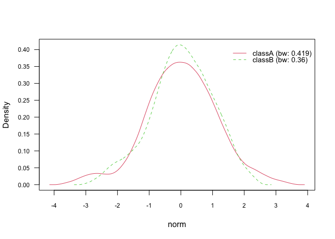
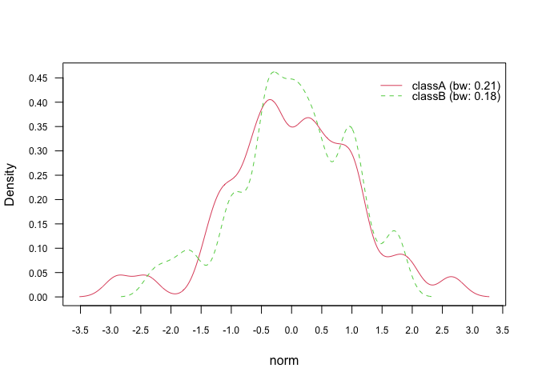
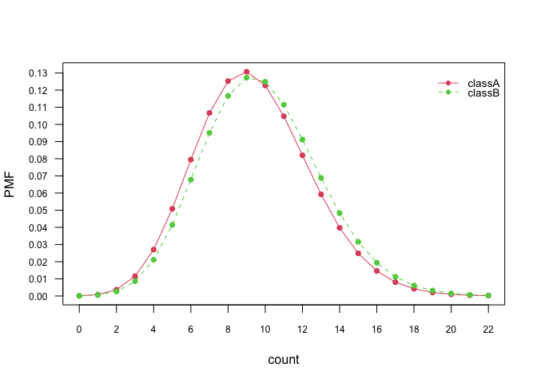

<!-- README.md is generated from README.Rmd. Please edit that file -->

Extended documentation can be found on the website:
<https://majkamichal.github.io/naivebayes/>

# Naïve Bayes 

<!-- badges: start -->

[](https://www.buymeacoffee.com/michalmajka)

[](https://cran.r-project.org/package=naivebayes)
[](http://cran.rstudio.com/web/packages/naivebayes/index.html)
[](https://cran.r-project.org/package=naivebayes)[](https://anaconda.org/conda-forge/r-naivebayes/)
[](https://anaconda.org/conda-forge/r-naivebayes/)

<!-- badges: end -->

## 1. Overview

The `naivebayes` package offers an efficient implementation of the
widely used Naïve Bayes classifier in R. It adheres to three fundamental
principles: `efficiency`, `user-friendliness`, and
`being written in Base R`. The package is designed to be efficient by
utilizing high-performance routines programmed in lower-level languages
like `C` or `FORTRAN` for resource-intensive computations. Despite being
written in `Base R`, it does not introduce any dependencies or hinder
its efficiency. The use of `Base R` ensures compatibility and
accessibility to a wide range of users.

By following these principles, the `naivebayes` package provides a
reliable and efficient tool for Naïve Bayes classification tasks,
ensuring that users can perform their analyses effectively and with
ease.

The general function `naive_bayes()` detects the class of each feature
in the dataset and, depending on the user choices, assumes possibly
different distribution for each feature. It currently supports following
class conditional distributions:

- categorical distribution for discrete features
- Poisson distribution for non-negative integers
- Gaussian distribution for continuous features
- non-parametrically estimated densities via Kernel Density Estimation
  for continuous features

In addition to that specialized functions are available which implement:

- Bernoulli Naive Bayes via `bernoulli_naive_bayes()`
- Multinomial Naive Bayes via `multinomial_naive_bayes()`
- Poisson Naive Bayes via `poisson_naive_bayes()`
- Gaussian Naive Bayes via `gaussian_naive_bayes()`
- Non-Parametric Naive Bayes via `nonparametric_naive_bayes()`

They are implemented based on the linear algebra operations which makes
them efficient on the dense matrices. They can also take advantage of
sparse matrices to furthermore boost the performance. Also few helper
functions are provided that are supposed to improve the user experience.
The general `naive_bayes()` function is also available through the
excellent `Caret` package.

## 2. Installation

The `naivebayes` package can be installed from the `CRAN` repository by
simply executing in the console the following line:

``` r
install.packages("naivebayes")

# Or the the development version from GitHub:
devtools::install_github("majkamichal/naivebayes")
```

## 3. Usage

The `naivebayes` package provides a user friendly implementation of the
Naïve Bayes algorithm via formula interlace and classical combination of
the matrix/data.frame containing the features and a vector with the
class labels. All functions can recognize missing values, give an
informative warning and more importantly - they know how to handle them.
In following the basic usage of the main function `naive_bayes()` is
demonstrated. Examples with the specialized Naive Bayes classifiers can
be found in the extended documentation:
<https://majkamichal.github.io/naivebayes/>

### 3.1 Example data

``` r
library(naivebayes)
#> naivebayes 0.9.7 loaded
#> For more information please visit:
#> https://majkamichal.github.io/naivebayes/

# Simulate example data
n <- 100
set.seed(1)
data <- data.frame(class = sample(c("classA", "classB"), n, TRUE),
                   bern = sample(LETTERS[1:2], n, TRUE),
                   cat  = sample(letters[1:3], n, TRUE),
                   logical = sample(c(TRUE,FALSE), n, TRUE),
                   norm = rnorm(n),
                   count = rpois(n, lambda = c(5,15)))
train <- data[1:95, ]
test <- data[96:100, -1]
```

### 3.2 Formula interface

``` r
nb <- naive_bayes(class ~ ., train)
summary(nb)
#> 
#> ================================= Naive Bayes ================================== 
#>  
#> - Call: naive_bayes.formula(formula = class ~ ., data = train) 
#> - Laplace: 0 
#> - Classes: 2 
#> - Samples: 95 
#> - Features: 5 
#> - Conditional distributions: 
#>     - Bernoulli: 2
#>     - Categorical: 1
#>     - Gaussian: 2
#> - Prior probabilities: 
#>     - classA: 0.4842
#>     - classB: 0.5158
#> 
#> --------------------------------------------------------------------------------

# Classification
predict(nb, test, type = "class")
#> [1] classA classB classA classA classA
#> Levels: classA classB
nb %class% test
#> [1] classA classB classA classA classA
#> Levels: classA classB

# Posterior probabilities
predict(nb, test, type = "prob")
#>         classA    classB
#> [1,] 0.7174638 0.2825362
#> [2,] 0.2599418 0.7400582
#> [3,] 0.6341795 0.3658205
#> [4,] 0.5365311 0.4634689
#> [5,] 0.7186026 0.2813974
nb %prob% test
#>         classA    classB
#> [1,] 0.7174638 0.2825362
#> [2,] 0.2599418 0.7400582
#> [3,] 0.6341795 0.3658205
#> [4,] 0.5365311 0.4634689
#> [5,] 0.7186026 0.2813974

# Helper functions
tables(nb, 1)
#> 
#> -------------------------------------------------------------------------------- 
#> :: bern (Bernoulli) 
#> -------------------------------------------------------------------------------- 
#>     
#> bern    classA    classB
#>    A 0.5000000 0.5510204
#>    B 0.5000000 0.4489796
#> 
#> --------------------------------------------------------------------------------
get_cond_dist(nb)
#>          bern           cat       logical          norm         count 
#>   "Bernoulli" "Categorical"   "Bernoulli"    "Gaussian"    "Gaussian"

# Note: all "numeric" (integer, double) variables are modelled
#       with Gaussian distribution by default.
```

### 3.3 Matrix/data.frame and class vector

``` r
X <- train[-1]
class <- train$class
nb2 <- naive_bayes(x = X, y = class)
nb2 %prob% test
#>         classA    classB
#> [1,] 0.7174638 0.2825362
#> [2,] 0.2599418 0.7400582
#> [3,] 0.6341795 0.3658205
#> [4,] 0.5365311 0.4634689
#> [5,] 0.7186026 0.2813974
```

### 3.4 Non-parametric estimation for continuous features

Kernel density estimation can be used to estimate class conditional
densities of continuous features. It has to be explicitly requested via
the parameter `usekernel=TRUE` otherwise Gaussian distribution will be
assumed. The estimation is performed with the built in `R` function
`density()`. By default, Gaussian smoothing kernel and Silverman’s rule
of thumb as bandwidth selector are used:

``` r
nb_kde <- naive_bayes(class ~ ., train, usekernel = TRUE)
summary(nb_kde)
#> 
#> ================================= Naive Bayes ================================== 
#>  
#> - Call: naive_bayes.formula(formula = class ~ ., data = train, usekernel = TRUE) 
#> - Laplace: 0 
#> - Classes: 2 
#> - Samples: 95 
#> - Features: 5 
#> - Conditional distributions: 
#>     - Bernoulli: 2
#>     - Categorical: 1
#>     - KDE: 2
#> - Prior probabilities: 
#>     - classA: 0.4842
#>     - classB: 0.5158
#> 
#> --------------------------------------------------------------------------------
get_cond_dist(nb_kde)
#>          bern           cat       logical          norm         count 
#>   "Bernoulli" "Categorical"   "Bernoulli"         "KDE"         "KDE"
nb_kde %prob% test
#>         classA    classB
#> [1,] 0.6498111 0.3501889
#> [2,] 0.2279460 0.7720540
#> [3,] 0.5915046 0.4084954
#> [4,] 0.5876798 0.4123202
#> [5,] 0.7017584 0.2982416

# Class conditional densities
plot(nb_kde, "norm", arg.num = list(legend.cex = 0.9), prob = "conditional")
```

<!-- -->

``` r

# Marginal densities
plot(nb_kde, "norm", arg.num = list(legend.cex = 0.9), prob = "marginal")
```

<!-- -->

#### 3.4.1 Changing kernel

In general, there are 7 different smoothing kernels available:

- `gaussian`
- `epanechnikov`
- `rectangular`
- `triangular`
- `biweight`
- `cosine`
- `optcosine`

and they can be specified in `naive_bayes()` via parameter additional
parameter `kernel`. Gaussian kernel is the default smoothing kernel.
Please see `density()` and `bw.nrd()` for further details.

``` r
# Change Gaussian kernel to biweight kernel
nb_kde_biweight <- naive_bayes(class ~ ., train, usekernel = TRUE,
                               kernel = "biweight")
nb_kde_biweight %prob% test
#>         classA    classB
#> [1,] 0.6564159 0.3435841
#> [2,] 0.2350606 0.7649394
#> [3,] 0.5917223 0.4082777
#> [4,] 0.5680244 0.4319756
#> [5,] 0.6981813 0.3018187
plot(nb_kde_biweight, "norm", arg.num = list(legend.cex = 0.9), prob = "conditional")
```

<!-- -->

#### 3.4.2 Changing bandwidth selector

The `density()` function offers 5 different bandwidth selectors, which
can be specified via `bw` parameter:

- `nrd0` (Silverman’s rule-of-thumb)
- `nrd` (variation of the rule-of-thumb)
- `ucv` (unbiased cross-validation)
- `bcv` (biased cross-validation)
- `SJ` (Sheather & Jones method)

``` r
nb_kde_SJ <- naive_bayes(class ~ ., train, usekernel = TRUE,
                               bw = "SJ")
nb_kde_SJ %prob% test
#>         classA    classB
#> [1,] 0.6127232 0.3872768
#> [2,] 0.1827263 0.8172737
#> [3,] 0.5784831 0.4215169
#> [4,] 0.7031048 0.2968952
#> [5,] 0.6699132 0.3300868
plot(nb_kde_SJ, "norm", arg.num = list(legend.cex = 0.9), prob = "conditional")
```

<!-- -->

#### 3.4.3 Adjusting bandwidth

The parameter `adjust` allows to rescale the estimated bandwidth and
thus introduces more flexibility to the estimation process. For values
below 1 (no rescaling; default setting) the density becomes “wigglier”
and for values above 1 the density tends to be “smoother”:

``` r
nb_kde_adjust <- naive_bayes(class ~ ., train, usekernel = TRUE,
                         adjust = 0.5)
nb_kde_adjust %prob% test
#>         classA    classB
#> [1,] 0.5790672 0.4209328
#> [2,] 0.2075614 0.7924386
#> [3,] 0.5742479 0.4257521
#> [4,] 0.6940782 0.3059218
#> [5,] 0.7787019 0.2212981
plot(nb_kde_adjust, "norm", arg.num = list(legend.cex = 0.9), prob = "conditional")
```

<!-- -->

### 3.5 Model non-negative integers with Poisson distribution

Class conditional distributions of non-negative integer predictors can
be modelled with Poisson distribution. This can be achieved by setting
`usepoisson=TRUE` in the `naive_bayes()` function and by making sure
that the variables representing counts in the dataset are of class
`integer`.

``` r
is.integer(train$count)
#> [1] TRUE
nb_pois <- naive_bayes(class ~ ., train, usepoisson = TRUE)
summary(nb_pois)
#> 
#> ================================= Naive Bayes ================================== 
#>  
#> - Call: naive_bayes.formula(formula = class ~ ., data = train, usepoisson = TRUE) 
#> - Laplace: 0 
#> - Classes: 2 
#> - Samples: 95 
#> - Features: 5 
#> - Conditional distributions: 
#>     - Bernoulli: 2
#>     - Categorical: 1
#>     - Poisson: 1
#>     - Gaussian: 1
#> - Prior probabilities: 
#>     - classA: 0.4842
#>     - classB: 0.5158
#> 
#> --------------------------------------------------------------------------------
get_cond_dist(nb_pois)
#>          bern           cat       logical          norm         count 
#>   "Bernoulli" "Categorical"   "Bernoulli"    "Gaussian"     "Poisson"

nb_pois %prob% test
#>         classA    classB
#> [1,] 0.6708181 0.3291819
#> [2,] 0.2792804 0.7207196
#> [3,] 0.6214784 0.3785216
#> [4,] 0.5806921 0.4193079
#> [5,] 0.7074807 0.2925193

# Class conditional distributions
plot(nb_pois, "count", prob = "conditional")
```

<!-- -->

``` r

# Marginal distributions
plot(nb_pois, "count", prob = "marginal")
```

<!-- -->
